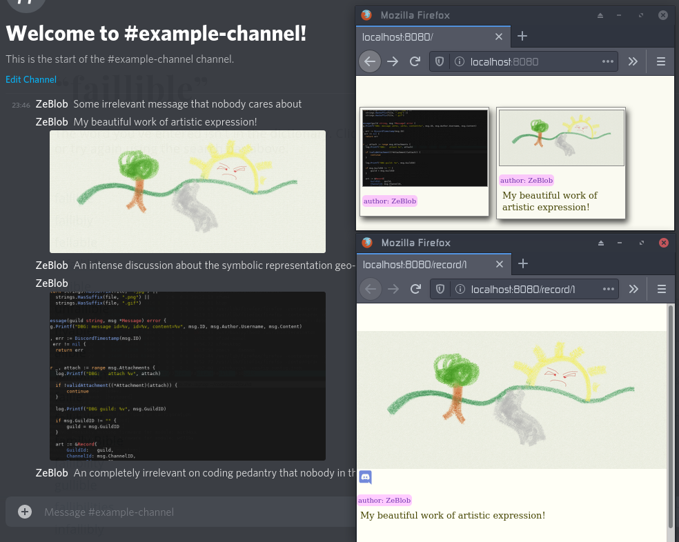

# Archivist

Archivist is a Discord bot whose goal is to archive images posted on a given
channel and make them available through a gallery.




## Design

Since anything posted on a Discord channel is ephemeral, keeping a historical of
images posted can make it easier to keep a historical record. Slapping a
tag-based index on top of that makes everything much easier to browse.

To avoid running into licensing and permission problems, **Archivist doesn't
copy any of the images it scrapes.** Instead, it relies on the Discord CDN to
serve the image via fun HTTP redirects.

The binary for the bot is comprised of:

- **Discord Scraper:** calls the discord API periodically (seconds) to fetch all
  latest messages on a channel which are then added to the database. Currently
  doesn't use the Discord gateway for simplicity reasons.

- **SQLite Database:** dirt simple sqlite DB to store and index all the scrapped
  data. I think it'll take a loooooong time before I have to worry about the
  scaling limits of SQLite so should be good enough for now.

- **REST API:** exposes the data available in the DB. Needs to be expanded quite
  a bit. Currently very limitted write functionalities because the internet is
  the internet and I don't have any form of auth or audit in place or rate
  limitting or all the things required to keep the bad people at bay.

- **Web Server:** Serves a very basic website for the puny humans to view all
  the wonderful data. Not using any form of overly convoluted web framework
  because I want to keep things extra simple.


## Installing

This is the Discord grant URL for the bot:

```
https://discord.com/api/oauth2/authorize?client_id=722589504569081939&scope=bot&permissions=66560
```

## Todo list

- Find someone that actually knows how to Web. UX is not my forte.
- ~Dockerization, Hosting, CI, DNS, SSL... ya know, details...~
- All that paranoid security stuff required to "trust" humans for write ops
- Extend DB search options in API
- ~Support more then one discord channel~
- Actual testing; I once wrote a bug. Never again.
- ~Backfill Scrapper to prime the DB. Makes it less boring.~
- Versioned database schema and migration mechanism
- Automatic tagging system.
- That thing where you write what things do and that nobody ever reads.
- Support for discord gateway for live sub and unsub
- Segment api per guild
- Probably lots more that I'm forgetting
